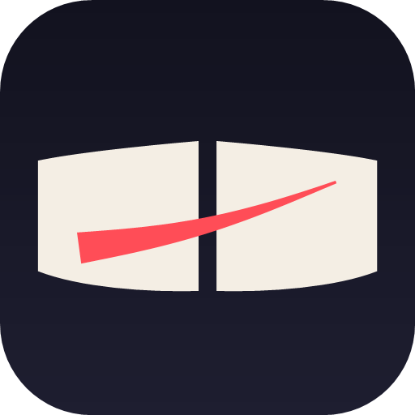

<div align="center">




### A novel-only reader for Android

[](LICENSE)
[](https://github.com/apauruseya7866er/Inkbound/releases)
[](https://github.com/apauruseya7866er/Inkbound/issues)
[](https://github.com/apauruseya7866er/Inkbound/actions/workflows/ci.yml)


<br/>

<p align="center">
  <a href="#-why-this-exists"><b>Why this exists</b></a> ·
  <a href="#-whats-actually-different"><b>What's different</b></a> ·
  <a href="#-what-it-does"><b>What it does</b></a> ·
  <a href="#-sources"><b>Sources</b></a> ·
  <a href="#-getting-the-app"><b>Get it</b></a> ·
  <a href="#-credits"><b>Credits</b></a>
</p>


</div>

> **A novel-only fork of Zangetsu.** No account, no cloud, no anime or manga, no
> second screen. Read-aloud that sounds like a person, sources from the LNReader
> ecosystem, and a Cloudflare path that actually works.
> [**Signed APKs →**](https://github.com/apauruseya7866er/Inkbound/releases)

---

## 💭 Why this exists

[Zangetsu](https://github.com/Spyou/Zangetsu) is a good app with one problem:
**it is three apps wearing a trenchcoat.**

It reads novels, and it streams anime and reads manga. If you are one of the
large majority who installed it for novels, you are paying for the other two in
ways that are easy to miss:

- **Settings you never open and cannot delete.** Anime and manga source
  management, trackers, region pickers, video players, a second-screen remote.
- **An APK carrying code you will never execute.** Anime and manga catalogues
  load at startup whether you want them or not.
- **A mode switch** that defaults you into a three-way "Streaming / Manga /
  Novel" picker — one tap before you reach the thing you opened the app for.
- **Bugs you did not cause**, reported by people using a half of the app you
  never touched.

Inkbound is that reader with everything else switched off.

| | **Zangetsu** | **Inkbound** |
|---|---|---|
| Media | Anime · Manga · Novels | **Novels only** |
| Account | Sign-in, cloud sync, Watch Together | **None. Nothing to log into.** |
| Data leaves the device | Only if you sign in | **Never, unless you export it yourself** |
| Second screen | Cast + remote control | **Removed** |
| Source index | Upstream LNReader | **Its own** — upstream tracked, our fixes published |
| Cloudflare handling | WebView solver | **Layered**: native TLS path, automatic solve, optional external proxy |
| CI | — | **Analyzer gate at zero errors/warnings, tests, release build** |
| Signed releases | Manual | **Every `v*` tag** |

**This is a fork, and the difference is intentional, not accidental.** The reader,
the source system, the downloads, the trackers and the read-aloud engine are
**Krishna Vishwakarma's** work, carried over intact — and it is the larger
project. If you use Inkbound, please [star the original](https://github.com/Spyou/Zangetsu).
Full [Credits](#-credits) below.

---

## 🔧 What's actually different

Not a wish list — this is what is in the tree, and where to look.

### 1. Novel-only, behind one flag

Every gate in the app reads a single flag in
[`lib/core/mode/novel_only.dart`](lib/core/mode/novel_only.dart). The anime and
manga code is still compiled — not deleted — so it stays type-checked against the
surrounding code and can be revived by flipping that one flag instead of
re-deriving a dozen conditions. A real delete is not possible here:
`ContentMode`, `ProviderType`, `ZKind` and `MediaKind` are matched exhaustively
across hundreds of `switch` expressions, so removing a case breaks compilation
everywhere. A flag keeps the tree honest *and* reversible.

### 2. No account. No cloud. No sync.

The account layer is **removed, not hidden** — there is no Supabase reference
left in dependency injection. There is nothing to sign up for, no token to
expire, and no server that learns which novels you read. Your library, history
and progress live on the device.

Backups are still yours: point the app at **any folder you choose**, including a
synced one, and it writes a plain JSON file you can read without this app.

### 3. Read-aloud that sounds like a person

- Full-sentence highlighting that tracks along with the narration.
- Voice, speed, pitch, and a sleep timer.
- A **sentence-gap control** — the pause between sentences is tuned down so it
  reads like speech instead of a machine enumerating clauses.
- Narration continues with the screen off, **resumes from the sentence you left
  rather than the chapter**, and stops when you swipe the app out of the task
  switcher instead of talking to an empty room.

### 4. Reading progress that survives Android

The obvious implementation — save on pause — loses your place when the system
kills a backgrounded app, which is exactly what it does to a reader. Inkbound
**writes the reading position to disk before the app can be killed**, and stores
it per book. Close it, swipe it away, come back tomorrow: it reopens on the line
you left, not the top of the chapter.

### 5. Text cleanup that follows through

Real sources ship junk inside the prose: donation pleas, Discord and Patreon
links, chapter footers, translator notes, decorative rules.

- Built-in rules strip it from the page.
- **Long-press any sentence to hide it — everywhere**, not just in the book you
  hid it in.
- The same rules apply to the page *and* to narration, so **the narrator never
  reads an ad aloud.**

### 6. Cloudflare, handled in layers

Most source scrapers break the moment a site sits behind Cloudflare, and the
usual responses are all wrong in a different way. Inkbound treats it as a ladder,
and each rung only runs if the one above failed:

1. **The right TLS stack.** The novel fetch runs on Android's native HTTP stack
   so it presents a browser-like TLS fingerprint. Sources behind a fingerprint
   gate never answer `dart:io` at all, and no header block fixes that.
2. **One cookie jar, not two.** The reader, the source system and the WebView
   solver all read and write the same cookie store. There is no second jar to
   arbitrate against, so a clearance earned in the solver cannot be shadowed by
   a stale copy held elsewhere — a real bug that shipped in an earlier
   revision of this fork.
3. **An automatic solve.** A Cloudflare challenge is detected on the response
   itself, and solved in a hidden WebView — under the same User-Agent the replay
   will send, because Cloudflare binds a clearance to the browser that earned it.
   **No tapping, no empty list.** If it needs a human, the app offers the visible
   solve.
4. **An external solver, if you want one.** For the hardest tier — where a
   clearance is bound to a fingerprint the app genuinely cannot reproduce — you
   can point Inkbound at a self-hosted [Solverr](https://github.com/unseensnick/Solverr),
   Byparr or FlareSolverr. Off by default; the app's own solver stays primary.

The hard truth, which the app does not pretend away: **if a site is on
Cloudflare's strictest tier, no in-app trick is enough** and a real browser has
to do the solving. That is why the last rung exists.

### 7. Its own source index

Inkbound serves sources from **[apauruseya7866er/plugins](https://github.com/apauruseya7866er/plugins)**,
a fork of the LNReader plugin ecosystem. It tracks upstream so its ~290 sources
today stay available, and it is where **our own scraper fixes are published** — so a
source broken for everyone here is fixed once, here, for everyone using this
index.

### 8. Upstream ties cut where they belonged to someone else

Pointing users at the original author's donation links, Discord, website and
community prompts is not a fork's job. The community prompt is gone, About shows
only this project's GitHub, the payment tiles are gone, and the updater and font
CDNs point at infrastructure this repository controls. `zangetsu.online` is kept
for exactly one thing — a share-link redirect that has to resolve for old
links — and is not linked anywhere else.

### 9. Engineering you can check

- **CI gates the analyzer.** `analysis_options.yaml` escalates the rules that are
  actually dangerous, and the workflow is **configured to fail on any error or
  warning** — not merely to report one.
  [](https://github.com/apauruseya7866er/Inkbound/actions/workflows/ci.yml)
- **Fakes are exercised, not merely passing.** A prior cleanup removed **41 stale
  `@override` annotations in test fakes** that were falling through to
  `noSuchMethod`, so those tests were green without calling what they claimed to
  test. The rule is escalated so it cannot come back quietly.
- **Signed releases from tags.** Push `v*`, get a signed APK on the releases
  page, and the release is refused if it turns out to be debug-signed.

---

## 📖 What it does

**Many sources, one library.** Add source plugins and each gets its own row on
the home page, pinned and ordered by you. Search and browse across all of them.

**A reader built for long chapters.** Continuous scroll or page-by-page, with
font, size, line height, letter and word spacing, alignment, and reading themes
that stay dark when the system flips to dark.

**Downloads and offline.** Pull chapters down and read without a connection.

**History where you expect it.** History sits on the dock, not buried in a menu.

**Local-first, on purpose.** No account, no telemetry, nothing leaving the phone
unless you export it.

---

## 📚 Sources

Inkbound ships **no content and no sources of its own.** It loads community
scrapers from the [LNReader](https://github.com/LNReader/lnreader-sources)
ecosystem, served through
**[apauruseya7866er/plugins](https://github.com/apauruseya7866er/plugins)**
(`plugins/v3.0.0`).

- The first launch seeds that index, so there is a catalogue immediately.
- The Sources screen can add further repositories by URL.
- Fixing a broken scraper means a pull request against the plugins repository.

---

## 📦 Getting the app

**Signed APKs are on the [releases page](https://github.com/apauruseya7866er/Inkbound/releases).**
Every `v*` tag produces one.

> If you install a release build and later build from source without
> `android/key.properties`, you get a **debug-signed** APK. Android will refuse
> to upgrade across that boundary — uninstall before switching. This is the one
> sharp edge in the whole project.

### Build it yourself

You will need the [Flutter SDK](https://docs.flutter.dev/get-started/install) —
Dart 3.11.5 or later — and an Android toolchain.

```bash
git clone https://github.com/apauruseya7866er/Inkbound.git
cd Inkbound

flutter pub get
flutter run                 # debug build on a connected device
flutter build apk --release # release APK → build/app/outputs/flutter-apk/
```

Signing config lives in `android/key.properties`, deliberately not in the
repository; `android/key.properties.example` shows the expected shape.

**Stack:** Flutter and Dart, [Hive](https://pub.dev/packages/hive) for local
storage, Kotlin `MethodChannel`s for the TTS engine, the JavaScript source
runtime, and storage access.

---

## 🙏 Credits

**Inkbound would not exist without [Zangetsu](https://github.com/Spyou/Zangetsu)
by [Krishna Vishwakarma](https://github.com/Spyou).** It carries the reader, the
source system, downloads, trackers, the read-aloud engine and most of everything
else you see here. The great majority of the 2,300+ commits in this history are
theirs, and so are most of the ideas. Please consider starring the original.

Thank you to everyone who has contributed to Zangetsu over the years, and to
everyone who has contributed here. The full roster is in
[`CONTRIBUTORS.md`](CONTRIBUTORS.md).

> **About the [contributors graph](https://github.com/apauruseya7866er/Inkbound/graphs/contributors):**
> it lists everyone whose commits are reachable from `main`, which includes the
> upstream Zangetsu history this fork was built from. Those names are inherited
> authorship, not people contributing to Inkbound — 59 of the 2,347 commits here
> are this fork's own work. The split is kept deliberately: rewriting history to
> shrink the graph would break GPL-3.0 attribution and orphan every existing fork
> and pull request. A [`.mailmap`](.mailmap) collapses the few people who appear
> under more than one email address into a single entry.

Source plugins come from the
[LNReader](https://github.com/LNReader/lnreader-sources) ecosystem, which is why
multi-source works as well as it does. Third-party notices are in
[`NOTICE.md`](NOTICE.md).

---

## ⚠️ Disclaimer

> [!IMPORTANT]
> **Inkbound is a reading tool only.** It does not host, provide, distribute or
> maintain any content or source extension.

- **Your responsibility.** You are solely responsible for how you use the app and
  for any third-party source you install, and must comply with applicable law and
  with copyright and intellectual-property rights.
- **No liability.** The maintainers disclaim all liability for misuse or legal
  issues arising from your use of the app or of any third-party service.
  Concerns about a third-party source belong with whoever made it.
- **No affiliation.** This project is not affiliated with or endorsed by the
  authors of any source extension it can load, nor by the Zangetsu project
  beyond the fork relationship described above.

---

## 📜 License

Inkbound is licensed under the **[GNU GPL-3.0](LICENSE)**.

Copyright © 2026 **Krishna Vishwakarma** (original Zangetsu project).
Modifications and the novel-only reworking © 2026 **apauruseya7866er**.

The full GPL-3.0 text is in [`LICENSE`](LICENSE). Attribution requirements in
[`NOTICE.md`](NOTICE.md), contribution terms in [`CLA.md`](CLA.md), and the
[AI usage policy](AI_POLICY.md) still apply to this codebase.

<div align="center">

<br/>


### Inkbound
*Novels only. Local only. Yours.*

<br/>

[🐛 Report an issue](https://github.com/apauruseya7866er/Inkbound/issues)
&nbsp;•&nbsp;
[📦 Releases](https://github.com/apauruseya7866er/Inkbound/releases)
&nbsp;•&nbsp;
[🔌 Plugin index](https://github.com/apauruseya7866er/plugins)
&nbsp;•&nbsp;
[⭐ Star Zangetsu](https://github.com/Spyou/Zangetsu)

<br/>

<details>
<summary>👀 Visitors</summary>


</details>

<br/>


</div>